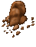
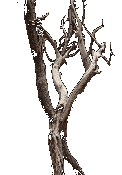
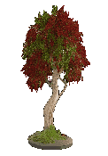

# <!DOCTYPE html>

# <html lang="en">

# <head>

# &nbsp;   <meta charset="UTF-8">

# &nbsp;   <meta name="viewport" content="width=device-width, initial-scale=1.0">

# &nbsp;   <title>MeesaResourcePack - Free 2D Artwork</title>

# &nbsp;   

# </head>

# <body>

# &nbsp;   

# &nbsp;       <h1>MeesaResourcePack</h1>

# &nbsp;       

# &nbsp;       

# &nbsp;           <strong>MeesaResourcePack</strong> is a collection of free 2D artwork generated to be used by anyone for <strong>any use</strong>.

# &nbsp;       

# &nbsp;       

# &nbsp;       

# &nbsp;           Meesa hope yousa be liken dis stuff. 💚

# &nbsp;       

# &nbsp;       

# &nbsp;       

# &nbsp;           All assets are provided as-is and are ready to drop into games, prototypes, tools, or whatever cursed or beautiful project you're building.

# &nbsp;       

# 

# &nbsp;       

# 

# &nbsp;       <h2>📦 Included Assets</h2>

# 

# &nbsp;       <h3>Objects</h3>

# 

# &nbsp;       

# &nbsp;           

# &nbsp;               

# &nbsp;               <h4>Boulder</h4>

# &nbsp;           

# 

# &nbsp;           

# &nbsp;               

# &nbsp;               <h4>Dead Tree</h4>

# &nbsp;           

# 

# &nbsp;           

# &nbsp;               

# &nbsp;               <h4>Tree</h4>

# &nbsp;           

# &nbsp;       

# 

# &nbsp;       <h2>📁 Folder Structure</h2>

# &nbsp;       

# &nbsp;           <em>(Add your folder structure information here)</em>

# &nbsp;       

# 

# &nbsp;   

# </body>

# </html>

